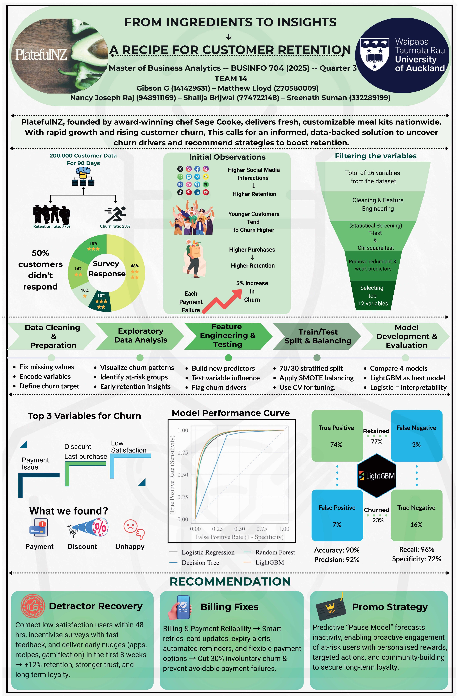

# PlatefulNZ Customer Churn Prediction

This project applies predictive analytics to identify churn risk for a New Zealand meal-kit subscription business.

## Business Problem

Subscription businesses need to identify customers at risk of churn before they cancel. This project models retention behaviour and highlights the customer attributes and engagement patterns that can inform targeted retention strategies.

## What This Project Demonstrates

- Customer churn framing for a subscription business
- Data preparation and feature engineering
- Classification modelling for retained vs churned customers
- Comparison of interpretable and higher-performing models
- Business recommendations from predictive analytics

## Tools Used

- R
- tidyverse
- Classification modelling
- Logistic regression
- Random forest
- LightGBM
- Business analytics reporting

## Repository Structure

```text
.
├── platefulnz_churn_analysis.qmd
├── reports/
│   └── platefulnz_churn_prediction_poster.jpg
└── README.md
```

## Project Poster

The repository includes a poster artifact summarising the churn prediction problem, modelling approach, and business recommendations.


